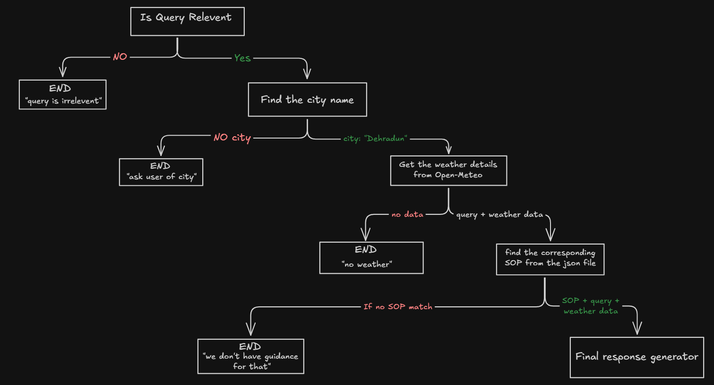

# Weather-Advisory Support Bot

A LangGraph agent that answers outdoor-activity safety questions ("is it safe to
cycle today," "should I take my kid to the park") using live weather data from
Open-Meteo, but only ever with advice that traces back to a written policy rule
(an SOP), never a free-floating model guess.

If a question isn't covered by any policy, the bot says so honestly instead of
inventing advice. If the weather API is unreachable, it says so plainly instead
of producing a plausible-sounding forecast.

## How it works

The agent is a single LangGraph graph with a conditional edge at every step that
can fail so the bot fails honestly (query irrelevant, city unresolved, weather
API down, no SOP applies) rather than proceeding on missing or irrelevant data.



**Flow:**

1. **Is query relevant?** — classifies whether the message is an outdoor-activity/
   weather-safety question at all. If not → `END` with "query is irrelevant."
2. **Find the city name** — extracts the city from the current message, falling
   back to earlier turns in the same session if the user doesn't repeat it. If no
   city can be resolved anywhere in the conversation → `END`, asks the user for one.
3. **Get the weather details from Open-Meteo** — geocodes the city, then fetches
   current/hourly/daily forecast fields. If either call fails or returns nothing
   → `END` with an honest "no weather data" message, not a guess.
4. **Find the corresponding SOP from the policy file** — matches the query and
   weather data against the SOP list (see [SOP policy](#sop-policy) below). If
   nothing matches → `END` with "we don't have guidance for that."
5. **Final response generator** — composes the answer using only the matched
   SOP's advice content and the real numbers from that request's weather data.

## Setup and run instructions

Requires [Bun](https://bun.sh) installed locally.

### Backend

```bash
cd backend
bun install
bun run dev
```

### Frontend (client)

```bash
cd frontend
bun install
bun run dev
```

### Environment variables

Both backend and frontend use a local `.env` file. Never commit this file; a
`.gitignore` entry for `.env` is included.

#### Backend

```dotenv
GOOGLE_API_KEY=your-google-api-key
CLIENT_URL=http://localhost:5173
OPENAI_TOKEN=your-openai-token
```

- `GOOGLE_API_KEY` — used for LLM calls inside the LangGraph nodes.
- `CLIENT_URL` — the frontend URL.
- `OPENAI_TOKEN` — used for the OpenAI 5.5 Mini LLM as the evaluator in the eval suite.

#### Frontend

```dotenv
VITE_BASE_URL=http://localhost:3000
```

`VITE_BASE_URL` is the backend URL used by the frontend.

### Running the eval suite

```bash
cd backend
bun run postinstall
bun run eval
```

`bun run postinstall` prepares whatever the eval harness needs before its first
run (fixtures/mocked weather payloads, etc.) run it once after installing, and
again if the eval fixtures change. `bun run eval` runs the suite and prints
pass/fail per case; see [Eval suite](#eval-suite) below for what each case checks.

### Evaluation results

The evaluation suite contains 6 weather-advisory questions. It uses an OpenAI
LLM-as-judge to measure two aspects of the agent's responses:

- **Faithfulness (GEval)** — whether the response follows the applicable SOP
  advice template, preserves important weather values and thresholds, and avoids
  unsupported or weaker safety guidance.
- **Task Completion** — whether the response successfully addresses the user's
  request and completes the expected weather-advisory task.

Latest recorded results:

| metric               | average score | pass rate | passed | total |
| -------------------- | ------------- | --------- | ------ | ----- |
| Faithfulness (GEval) | 0.93          | 100.00%   | 6      | 6     |
| Task Completion      | 0.83          | 83.33%    | 5      | 6     |

## SOP policy

SOPs live at **`backend/agent/sop.policy.ts`**, as a plain exported object
(`policy.sops[]`), loaded at runtime — not embedded in any prompt. Adding or
editing a policy means editing this one file; no fetch or model code needs to
change, including for a brand-new SOP added on the spot.

Each SOP has:

| field                                     | purpose                                                                                                        |
| ----------------------------------------- | -------------------------------------------------------------------------------------------------------------- |
| `sop_id`, `title`, `category`, `severity` | identity, grouping, and severity tier (`info` < `low` < `moderate` < `high` < `critical`)                      |
| `trigger_type`                            | how the condition should be evaluated and where it sits in the matching order — see below                      |
| `weather_fields_used`                     | which Open-Meteo fields this SOP's condition reads                                                             |
| `condition.description`                   | the actual rule, in plain language                                                                             |
| `activity_keywords`                       | representative examples of what questions this SOP covers (semantic match, not an exhaustive literal list)     |
| `advice_template`                         | the source of truth for what the bot is allowed to say the model paraphrases this, it doesn't invent beyond it |

### `trigger_type` — four roles a rule can play

- **`numeric`** — a clean threshold against one or more weather fields (UV ≥ 8,
  wind gusts ≥ 45 km/h). Only checked once the question's stated activity
  overlaps the SOP's `activity_keywords`.
- **`fuzzy`** — no single threshold decides it; several fields are weighed
  together as a holistic judgment call (`SOP-011`, picnic suitability). Still
  gated by keyword relevance like `numeric`; the difference is _how_ "condition
  met" is decided, not _when_ it's checked.
- **`situational_override`** — checked against the weather data alone,
  independent of what the user asked about, and checked first. Used for hazards
  that don't belong to one activity category (an active rain system is a risk to
  cycling, travel, and picnics alike). Not filtered out by severity tie-breaking
  either, an override and a category-specific SOP can both appear in one answer.
- **`fallback`** — only matches if nothing else did, but the question's activity
  still falls inside a domain this policy set actually covers. Reports the real
  numbers with no hazard framing, rather than the bot going straight to "no
  guidance" for an ordinary, calm-weather question.

### Matching order

1. **Overrides** — every `situational_override` SOP, checked against weather
   only, regardless of category.
2. **Hazard match** — `numeric` and `fuzzy` SOPs whose category/keywords fit the
   question's intent, evaluated against the same weather data.
3. **Tie-break** — if more than one hazard SOP matched, keep only the
   highest-severity tier; if several share the top tier, return all of them
   rather than silently picking one. This is a deliberate choice, not a default:
   we'd rather the final answer surface two genuinely-true concerns than drop one
   because something else happened to be rated more severe.
4. **Baseline** — if no override and no hazard SOP matched, but the question is
   in a domain the policy set covers, apply the `fallback` SOP.
5. **No match** — if the question doesn't fall into any domain this policy set
   defines at all (not even the baseline's), say so plainly.
